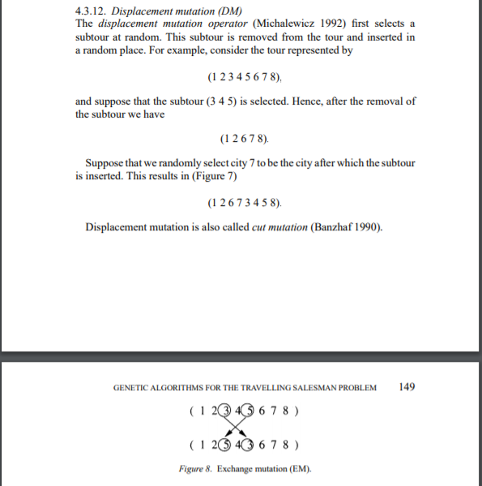
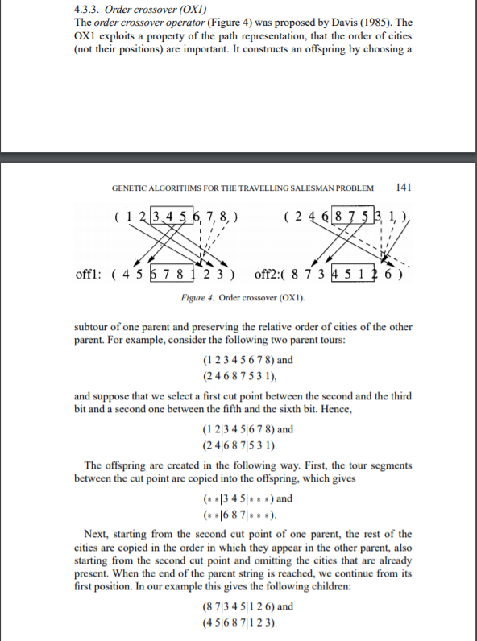

# TP : Algorithme génétique

Dans le TP, on va implémenter un algorithme génétique qui cherche à maximiser une fonction, car cela rend plus simple entre autres le choix des parents avant les crossovers.

Néanmoins, lors des tests de notre algorithme sur les fonctions vectorielles ou sur le problème du voyageur de commerce, les fonctions doivent être minimisées, on passera donc comme fonction à notre algorithme l'opposé de la fonction réelle : si on cherche à minimiser f on cherche à maximiser -f.

De plus, pour le reste du TP on appellera fitness_function la fonction que l'algorithme génétique cherche à maximiser et fitness_score la valeur d'un individu sur cette même fonction, c'est son score : fitness_score = fitness_function(chromosomes)


## Fonctions vectorielles (level 1 à level 6)

Dans un premier temps, on cherchera à minimiser des fonctions vectorielles. Elles sont définies dans le fichier test_functions.py, il y a 10 niveaux différents, mais on ne traitera pour le moment que les 6 premiers niveaux. Par ailleurs la dimension de l'espace des solutions donc des vecteurs d'entrée des fonctions est indiqué ainsi que le vecteur correspondant au minimum.

## Compléter la définition de la classe d'un individu vectoriel

L'ensemble des fonctions à compléter se trouve dans le fichier individual_vector.py.

On veillera à définir les chromosomes d'un individu grâce à un array numpy pour faciliter les opérations de mutation et de crossover et les rendre plus performantes.

### 1. Méthode d'initialisation

Définition et initialisation les attributs nécessaires. Ce sont les attributs qui vont appartenir à chaque individu.

<details>
<summary>Spoiler warning</summary>

* Dimension du vecteur (_shape_)
* Intervalle de recherche (_starting_interval_), l'implémentation est libre mais si vous ne savez pas comment faire un simple réel fera l'affaire.
On prendra par exemple, ensuite chaque composante du vecteur de chromosomes dans [-_starting_interval_; _starting_interval_]. 
* Chromosomes de l'individu (_chromosomes_), comme déjà précisé on utilisera la bibliothèque numpy pour représenter un vecteur grâce à un array numpy. On chercher donc à créer un array numpy de taille shape contenant des réels aléatoires compris dans l'intervalle [-_starting_interval_; _starting_interval_].
    <details>
    <summary>Spoiler warning</summary>
    On peut utiliser la fonction numpy : numpy.random.uniform.

            chromosomes = np.random.uniform(low=-starting_interval, high=starting_interval, size=shape)
    </details>
* Score de l'individu (_fitness_score_), c'est la l'évaluation de l'individu sur notre problème soit la valeur de la fonction à maximiser sur les chromosomes de l'individu.
* Fonction de score (_fitness_function_), on veut sauvegarder la fonction de score, de fitness pour pouvoir réévaluer le score de l'individu après une mutation.
</details>

### 2. Méthode de crossover

Un crossover correspond à la reproduction de deux individus. Pour ce TP, on choisi qu'un crossover donne lieu à deux nouveaux individus (deux enfants). On va prendre deux parents pour avoir deux nouveaux individus dont les chromosomes sont un mixte des chromosomes de leurs parents. Comme l'on travaille avec des vecteurs, on peut prendre dans un premier temps la moyenne des chromosomes de leurs parents.

    chromosomes_enfant = parent1 * 0.5 + parent2 * 0.5

Néanmoins, avec une simple moyenne, on obtient deux enfants identiques, on va donc faire une moyenne pondérée entre les deux vecteurs parents en choisissant un coefficient aléatoire.


<details>
<summary>Spoiler warning</summary>

    a = np.random.uniform()
    chromosomes_enfant = parent1 * (a) + parent2 * (1-a)


</details>


### 3. Méthode de mutation

Une mutation, c'est une modification du matériel génétique d'un individu, c'est-à-dire une modification des chromosomes d'un individu. Ici, pour des chromosomes représentant un vecteur, on va appliquer la formule :

    d = distance caractéristique interindividu
    chromosomes = chromosomes + b(d)

La distance caractéristique inter-individu peut être défini de nombreuses manière elle cherche à exprimer la disparité dans l'espace de solution des individus constituant la population. Nous, on va la définir comme la distance entre deux individus pris de manière aléatoire (l'individu que l'on mute et un autre individu).

b est une fonction de bruit, c'est-à-dire une variable aléatoire, il reste donc à choisir la distribution (gaussienne, uniforme, ...) de cette variable aléatoire. Une fois la distribution choisie, on va souvent choisir les paramètres de la distribution de telle sorte que la moyenne soit nulle et la variance un multiple de la distance caractéristique inter-individu.

<details>
<summary>Spoiler warning</summary>

    d = chromosomes_to_mute - chromosomes_indivudal_random
    chromosomes = chromosomes_to_mute + np.random.uniform(low=-d, high=d)

</details>


## Completer la définition de la classe de l'algorithme génétique

L'ensemble des fonctions à compléter se trouve dans le fichier AlgoGen.py.

On va maintenant chercher à implémenter l'algorithme génétique. On veut implémenter un algorithme général qui pourra optimiser n'importe quelle fonction et donc sur n'importe quel type d'individu pour peu qu'il suive la même structure que notre Individual_vector.

On prend également comme déjà énoncé, on se place dans le cadre dans lequel l'algorithme génétique cherche à `maximiser` la fonction de fitness quitte à optimiser -f pour un problème de minimisation.

### 1. Méthode d'initialisation :

Définition et initialisation les attributs nécessaires. Ce sont les attributs qui vont appartenir à une instance de notre algorithme génétique.


<details>
<summary>Spoiler warning</summary>

* Taille de la population (pop_size), permet de se souvenir de la taille voulue de la population pour avoir une taille de population constante au début de chaque génération.
* Fréquence de mutation (mutation_rate)
* Fréquence de crossover (crossover_rate)
* Population (population), on implémentera la population sous la forme d'une liste qui contiendra les différents individus (des instances de la classe _Indiv_)
    <details>
    <summary>Spoiler warning</summary>
    
    * On créé une liste contenant les individus voulus grâce à l'argument _Indiv_ de la fonction _init_
    qui correspond à la classe _individual\_vector_ ou _individual\_path_ en fonction des besoins.

    Exemple : 

        Indiv(shape=shape, fitness_function=fitness_function, starting_interval=starting_interval)

    
    <details>
    <summary>Spoiler warning</summary>
    Finalement:

        population = [Indiv(shape=shape, fitness_function=fitness_function, starting_interval=starting_interval) for _ in range(pop_size)]
    

    </details>
    </details>

* Meilleur individu (best_indv), on veut garder une référence au meilleur individu actuel, c'est-à-dire à l'individu dont le _fitness_score_ et le plus élevé dans la population pour pouvoir observer le comportement de notre population lors de l'exécution. Pour classer la population par le _fitness_score_ de ses individus, on peut utiliser la méthode **sort** qui est implémenté dans la classe List.
Néanmoins, lorsque python va vouloir trier notre liste, il va effectuer des comparaisons entre différents éléments de la liste soit ici des individus (des instances de la classe Individual_vector ou Individual_path) et il ne sait pas comment définir ces comparaisons. Pour résoudre ce problème, on va dire à python d'appliquer une fonction sur les individus avant de les comparer via la paramètre **key** de la fonction **sort**.

```
    population.sort(key=fonction)
```
<details>
<summary>Spoiler warning</summary>


    population.sort(key=lambda indiv:indiv.fitness_score)


</details>
</details>

### 2. Méthode _parents_selection_  : Sélection des parents

On va ici chercher à implémenter une méthode que l'on pourra par la suite appeler pour obtenir deux parents dès que l'on voudra faire un crossover. La méthode ne prend donc aucun argument en entrée à l'exception de self et devra renvoyer deux individus de la population qui seront utilisés pour effectuer un crossover.

On choisira pour cette première partie de TP d'implémenter la méthode du tournoi. Dans notre population de n individus on en choisit k (par exemple k = 0.1 * n) de manière aléatoire et parmi ces k individus on choisit les deux meilleurs pour être les parents. 

<details>
<summary>Spoiler warning</summary>

* Pour obtenir un sous-ensemble de la population on peut utiliser la fonction sample depuis le module random :

    ```
    k_individus = random.sample(population, k=k)
    ```
* Ensuite il suffit de trier la liste k_individus et de prendre les deux derniers individus de la liste donc ceux avec le plus gros _fitness_score_.

    
</details>

### 3. Méthode _survivor_selection_ : Sélection des survivants

On va implémenter ici une méthode que l'on appellera à la fin de chaque génération, elle se chargera de garder uniquement les meilleurs individus de notre population pour la prochaine génération enfin de garder un nombre d'individus constant.


### 4. Méthode _step_ : Une itération de l'algorithme

Pour finir la méthode step, cette méthode va reprendre toutes les étapes de l'algorithme génétique et va effectuer un passage d'une génération à une autre.

1. On doit d'abord effectuer les crossovers pour peupler la population d'enfants (de nouveaux individus).
2. Ensuite, on va faire muter une partie de cette population.
3. Et pour finir, on va sélectionner les survivants pour la génération suivante.


## Approximation du problème du voyageur de commerce

[Description du problème](https://fr.wikipedia.org/wiki/Probl%C3%A8me_du_voyageur_de_commerce)

Pour représenter un chemin possible en passant par les n villes du problème, on numérote les villes de 0 à n-1. Puis on prend une permutation de [0;n-1].

Exemple:
Pour n = 5,

[1,2,3,4,0] -> Le voyageur commence à la ville 1 puis 2 etc... jusqu'à revenir en 1 après la ville 0.

L'ensemble des fonctions à compléter se trouve dans le fichier individual_path.py.

### Completer la définition de la classe d'un individu chemin

### 1. Méthode d'initialisation


Définition et initialisation les attributs nécessaires. Ce sont les attributs qui vont appartenir à chaque individu.

<details>
<summary>Spoiler warning</summary>

* Nombre de villes (shape)
* Score de l'individu (fitness_score)
* Fonction de fitness (fitness_function)
* Chromosomes de l'individu (chromosomes), comme énoncé les chromosomes de l'individu sont une permutation de [0;shape-1].

<details>
<summary>Spoiler warning</summary>

Pour obtenir une permutation aléatoire on peut utiliser la fonction : numpy.random.permutation

```
chromosomes = np.random.permutation(shape)
```

</details>

</details>


### 2. Méthode de crossover

Définir un crossover entre deux permutations peut se révéler être légèrement compliqué, rien d'insurmontable, mais pour cette première implémentation, on va se contenter de prendre deux nouveaux individus aléatoires être les nouveaux enfants.

Pour approfondir et obtenir de bien meilleurs résultats, vous avez dans la suite du TP toutes les ressources nécessaires.

### 3. Méthode de mutation

De la même manière il existe de nombreuses fonctions de mutation d'une permutation plus ou moins compliqué, dans un premier temps on va nous échanger la position de deux villes dans notre parcours.

## Fonctions vectorielles (level 7 à level 9)

### Amélioration la définition de la classe de l'algorithme génétique

### 1. Nouvelle méthode de sélection des parents

1. Roulette
    <details>
    <summary>Spoiler warning</summary>
        
    Si tu es arrivé là, c'est que tu te débrouilles bien, mais voilà une syntaxe qui pourra sûrement te servir :
        parents = np.random.choice(self.population, size=2, p=proba)
    </details>
2. Stochastic Universal Sampling [Description de l'algorithme](https://en.wikipedia.org/wiki/Stochastic_universal_sampling)

### 2. Sauvegarde d'une population élite

En mutant toute la population, on risque de muter nos meilleurs individus et d'obtenir des individus beaucoup moins bons, on va donc sauvegarder les individus "élites" de notre population, c'est-à-dire une proportion de la population avec les meilleurs résultats.

1. Définition d'une méthode de copie dans la classe des individus
    <details>
    <summary>Spoiler warning</summary>
        
    Attention ne pas oublier que les listes et les arrays numpy sont référencés par rapport à leur adresse mémoire.
    </details>
    
2. Sauvegarde des meilleurs élements par copie avant les mutations
3. Mutation sur toute la population

## Amélioration du problème du voyageur de commerce

### 1. Nouvelle méthode de mutation

1. Méthode de 'Displacement' 

Description de l'algorithme :



Displacement mutation is also called cut mutation (Banzhaf 1990).

### 2. Nouvelle méthode de crossover

1. Méthode 'OX1'

Description de l'algorithme :



[Publication originale pour les deux nouvelles méthodes](https://link.springer.com/content/pdf/10.1023/A:1006529012972.pdf)
